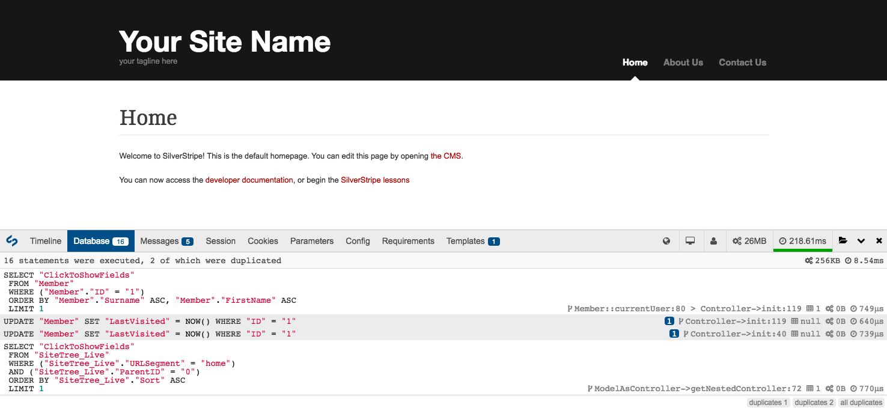

# SilverStripe DebugBar module

[](https://travis-ci.org/lekoala/silverstripe-debugbar/)
[](https://scrutinizer-ci.com/g/lekoala/silverstripe-debugbar/)
[](https://codecov.io/gh/lekoala/silverstripe-debugbar)

## Introduction

SilverStripe Debug Bar is a wrapper for [PHP DebugBar](http://phpdebugbar.com) which integrates with SilverStripe to provide more useful information about your projects. The Debug Bar can help you to easily identify performance issues, analyse environment settings and discover which parts of your code are being used.

This module will:

* Log framework execution based on available hooks
* Log and profile database calls
* Show all `SS_Log` log entries from SilverStripe
* Show all session, cookie, requirements, SiteConfig and request data
* Show current locale, framework/CMS version, current member
* Show request timing/profiling and memory consumption

The DebugBar is automatically injected into any HTML response through the `DebugBarRequestFilter`, and will only run in "dev" mode.



## Requirements

* SilverStripe ^4.0
* [maximebf/php-debugbar](http://phpdebugbar.com)
* [jdorn/sql-formatter](https://github.com/jdorn/sql-formatter)

## Installation

You can install the debug bar with Composer:

```
composer require --dev lekoala/silverstripe-debugbar
```

## Documentation

For more information on using and configuring this module please [see the documentation section](docs/en).

## Maintainer

LeKoala - thomas@lekoala.be

## License

This module is licensed under the [MIT license](LICENSE).
