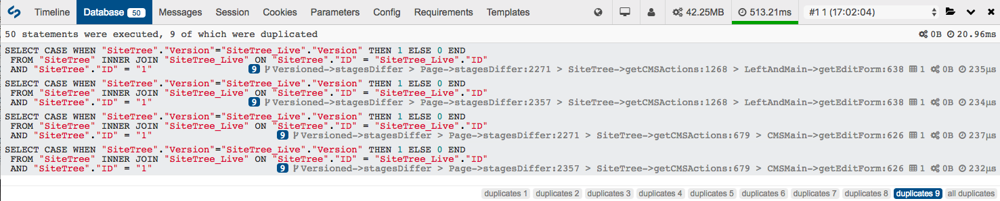
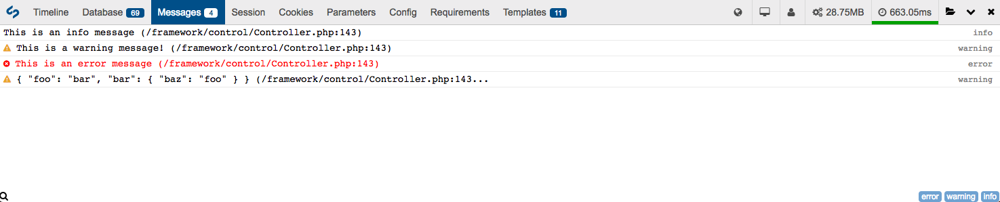

# SilverStripe DebugBar module

[](https://travis-ci.org/lekoala/silverstripe-debugbar/)
[](https://scrutinizer-ci.com/g/lekoala/silverstripe-debugbar/)
[](https://codecov.io/gh/lekoala/silverstripe-debugbar)

## Requirements

* SilverStripe ^3.2
* [maximebf/php-debugbar](http://phpdebugbar.com)
* [jdorn/sql-formatter](https://github.com/jdorn/sql-formatter)

## Installation

You can install the debug bar with Composer:

```
composer require --dev lekoala/silverstripe-debugbar
```

---

## Documentation

* [Introduction](#introduction)
* [Execution timeline](#execution-timeline)
* [Database profiling](#database-profiling)
* [System logs and messages](#system-logs-and-messages)
* [Template use](#template-use)
* [Environment and other information](#environment-and-other-information)
* [Helper methods](#helper-methods)
* [Configuration options](#configuration-options)
* [Troubleshooting](#troubleshooting)

### Introduction

SilverStripe Debug Bar is a wrapper for [PHP DebugBar](http://phpdebugbar.com) which integrates with SilverStripe to provide more useful information about your projects. The Debug Bar can help you to easily identify performance issues, analyse environment settings and discover which parts of your code are being used.

For example, if your application is running the same database query multiple times in a loop, or a certain controller action is taking a long time to run, Debug Bar will highlight these bottlenecks so you can take steps to improve your overall site performance.

This module will:

* Log framework execution based on available hooks
* Log and profile database calls
* Show all `SS_Log` log entries from SilverStripe
* Show all session, cookie, requirements, SiteConfig and request data
* Show current locale, framework/CMS version, current member
* Show request timing/profiling and memory consumption

The DebugBar is automatically injected into any HTML response through the `DebugBarRequestFilter`, and will only run in "dev" mode.


### Execution timeline

The execution timeline ("Timeline" tab) provides you with a graphical overview of each controller and action, listing how long it takes for each to complete.


The example above is from loading a page in the CMS.

### Database profiling

The "Database" tab allows you to view a list of all the database operations that a page request has made, and will group duplicated queries together. This can be useful to identify areas where performance can be improved, such as using `DataObject::get_by_id()` (which caches the result) instead of `DataObject::get()->byID()`.


By clicking on one of the duplicate group badges in the bottom right corner, you can see groups of duplicated queries:



To help you in debugging and optimising your application, it is recommended to leave the `find_source` option on. This will help you to identify what triggers the query and where to implement caching appropriately.

If you are using `?showqueries=1`, you will also see that the usage has been optimised to display all queries nicely and their result on the page.

Also remember that if you use [the `d()` helper](helpers.md), any string variable with "sql" in the name will be formatted as a SQL string.

#### Long running queries

When some queries take a long time to run they will be highlighted in red, with the request time (right hand side per item) highlighted in bold red text. The threshold for this time can be adjusted by modifying the `DebugBar.warn_dbqueries_threshold_seconds` [configuration](configuration.md) setting.


**Note:** The above example has been adjusted to be deliberately short. The default threshold value is one second for a long running query.

#### Large numbers of queries

If a page request performance is more than a certain number of queries, a warning message will be sent to the "Messages" tab. You can adjust the threshold for this with the `DebugBar.warn_query_limit` configuration setting.


### System logs and messages

The "Messages" tab will show you a list of anything that has been processed by `SS_Log` during a page execution:



You can filter the list by type by clicking on one of the log level buttons in the bottom right corner.

**Note:** At times, other DebugBar components may also send messages to this tab.

### Template use

The "Templates" tab will show you how many template calls were made, and the file path relative to the project root directory for each.

This will only be populated when you are flushing your cache (`?flush=1`). When templates are cached, a notice will be displayed letting you know to flush to see the full list.


### Environment and other information

There is a variety of other useful information available via various tabs and indicators on the debug bar. See the screenshot below, and the arrows explained in order from left to right:


#### Tabs

* **Session:** Displays a list of everything in your current SilverStripe session
* **Cookies:** Displays a list of all cookies available in a request
* **Parameters:** Displays all GET, POST and REQUEST parameters from the current request
* **Config:** Displays a list of the current [SiteConfig](https://github.com/silverstripe/silverstripe-siteconfig) settings from the CMS
* **Requirements:** Shows a list of all [`Requirements`](https://docs.silverstripe.org/en/developer_guides/templates/requirements/) calls made during a page's execution

#### Indicators

Hover over indicators to see:

* **Locale:** The locale currently being used in the site
* **Version:** The current SilverStripe software version being used
* **User:** The name of the user currently logged in
* **Memory usage:** The amount of memory used to generate a page
* **Request time:** The total time to generate a page (see below)

##### Request time

The request time indicator shows you how long it took for the server to render a page, it doesn't include the time your browser takes to render it. You can use browser consoles to profile this aspect.

* For a regular page load, the request time will have a green underline to indicate a healthy speed
* For a slower page load, the request time will have an orange underline to indicate that it took longer than it perhaps should have, but is still OK
* For a long page load, the request time will have a red underline to indicate that it is potentially dangerously slow

The threshold for a dangerously slow page load can be configured with the `DebugBar.warn_request_time_seconds` [configuration](configuration.md) setting.

The threshold for a slower/warning level indicator is defined as a percentage of the dangerous threshold (by default, 50%). This can be adjusted by modifying the `DebugBar.warn_warning_ratio` configuration setting.


### Helper methods

#### Quick debugging

The `d()` function helps you to quickly debug code. It will use the [Symfony VarDumper](https://github.com/symfony/var-dumper) to display the data in a "pretty" way.

In an XHR/AJAX context, it will simply display the data in a more simple fashion.

When `d()` is called without arguments, it will display all objects in [the debug backtrace](http://php.net/manual/en/function.debug-backtrace.php). It will display the variable name before its content to make it easy to identify data amongst multiple values.

```php
d($myvar, $myothervar);
```

Any call to `d()` with "sql" in the name of the variable will output a properly formatted SQL query, for instance:

```php
d($myDataList->sql());
```

#### Quick logging

The `l()` function helps you to log messages, and since they will appear in the "Messages" tab, it is very useful.

```php
l('My message');
```


### Configuration options

Wherever possible, features and settings have been made configurable. You can see a list of the default configuration settings by looking at `_config/debugbar.yml`. To modify any of these settings you can define a YAML configuration block in your `mysite/_config` folder, for example:

**\_mysite/config/debugbar.yml:**
```yaml
---
Name: mysitedebugbar
---
DebugBar:
  enabled_in_admin: false
  query_limit: 500
```

#### Settings

|Setting|Type|Description|
|---|---|---|
| `enable_storage` | bool | Store all previous request in the temp folder (enabled by default) |
| `auto_debug` | bool| Automatically collect debug and debug_request data (disabled by default) |
| `ajax` | bool | Automatically inject data in XHR requests (disabled by default, since this makes the Chrome request inspector very slow due to the large amount of header data) |
| `force_proxy` | bool | Always use the database proxy instead of built in PDO collector (enabled by default) |
| `check_local_ip` | bool | Do not display the DebugBar if not using a local ip (enabled by default) |
| `find_source` | bool | Trace which file generates a database query (enabled by default) |
| `enabled_in_admin` | bool | enable DebugBar in the CMS (enabled by default) |
| `include_jquery` | bool | Let DebugBar include jQuery. Set this to false to include your own jQuery version |
| `query_limit` | int | Maximum number of database queries to display (200 by default for performance reasons) |
| `warn_query_limit` | int | Number of database queries before a warning will be displayed |
| `warn_dbqueries_threshold_seconds` | int | Threshold (seconds) for how long a database query can run for before it will be shown as a warning |
| `warn_request_time_seconds` | int | Threshold (seconds) for what constitutes a *dangerously* long page request (upper limit) |
| `warn_warning_ratio` | float | Ratio to divide the warning request time by to get the *warning* level (default 0.5) |

#### Disabling the debug bar

You can disable the debug bar with PHP or configuration:

```php
define('DEBUGBAR_DISABLE', true);
```

```yaml
DebugBar:
  disabled: true
```

### Troubleshooting

#### Managing jQuery

The DebugBar will include its own version of jQuery by default. It will only be disabled
in the admin (which already use jQuery).

If you have added jQuery in your requirements (filename must be jquery.js or jquery.min.js),
the DebugBar will not load its own jQuery version. You can also set the following
configuration flag to false to prevent the DebugBar from including its own jQuery.

```yaml
DebugBar:
  include_jquery: false
```

If you are including jQuery yourself, it is expected you include it in `Page::init()`.
Below is an example of how to the jQuery which ships with the framework:

```php
public function init()
{
    parent::init();
    Requirements::javascript(FRAMEWORK_DIR . '/thirdparty/jquery/jquery.min.js');
}
```

#### A quick note about the Security Page

`DebugBarControllerExtension` will include for you all the required assets for DebugBar.

This is done using the `onAfterInit` extension hook, however on the `Security` controller the `onAfterInit` is called before your `init()`
method in the `Page_Controller`.

Since you need to add jQuery before DebugBar this may be a problem, and therefore requirements will NOT be included on the `Security` controller.

If you want DebugBar to work on the `Security` controller, make sure to include all relevant requirements by calling `DebugBar::includeRequirements();` after you include jQuery. When DebugBar is disabled this call will be ignored. Also note that any subsequent call to this method will be ignored as well.


---

## Maintainer

LeKoala - thomas@lekoala.be

## License

This module is licensed under the [MIT license](LICENSE).
