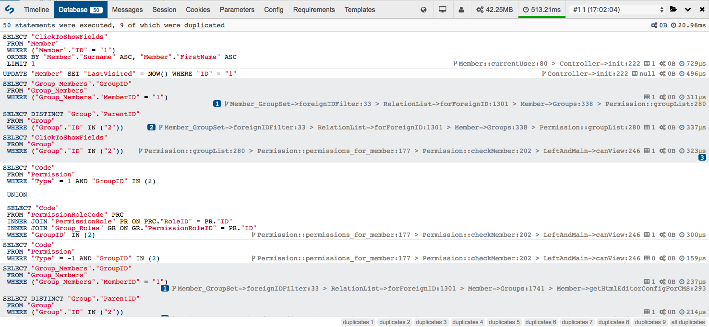
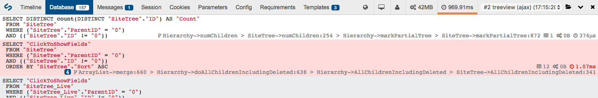
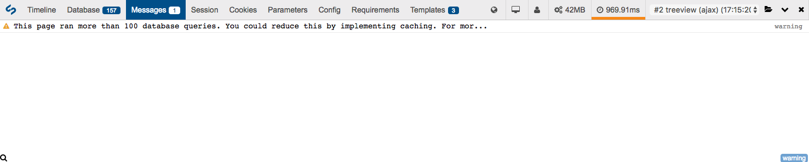

# Database profiling

The "Database" tab allows you to view a list of all the database operations that a page request has made, and will group duplicated queries together. This can be useful to identify areas where performance can be improved, such as using `DataObject::get_by_id()` (which caches the result) instead of `DataObject::get()->byID()`.

By clicking on one of the duplicate group badges in the bottom right corner, you can see groups of duplicated queries:

To help you in debugging and optimising your application, it is recommended to leave the `find_source` option on. This will help you to identify what triggers the query and where to implement caching appropriately.

If you are using `?showqueries=1`, you will also see that the usage has been optimised to display all queries nicely and their result on the page.

Also remember that if you use [the `d()` helper](helpers.md), any string variable with "sql" in the name will be formatted as a SQL string.

## Long running queries

When some queries take a long time to run they will be highlighted in red, with the request time (right hand side per item) highlighted in bold red text. The threshold for this time can be adjusted by modifying the `DebugBar.warn_dbqueries_threshold_seconds` [configuration](configuration.md) setting.

**Note:** The above example has been adjusted to be deliberately short. The default threshold value is one second for a long running query.

## Large numbers of queries

If a page request performance is more than a certain number of queries, a warning message will be sent to the "Messages" tab. You can adjust the threshold for this with the `DebugBar.warn_query_limit` configuration setting.

