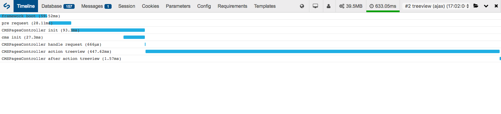

# Execution timeline

The execution timeline ("Timeline" tab) provides you a graphical overview of each controller and action, listing how long it takes for each to complete.

The example above is from loading a page in the CMS.
